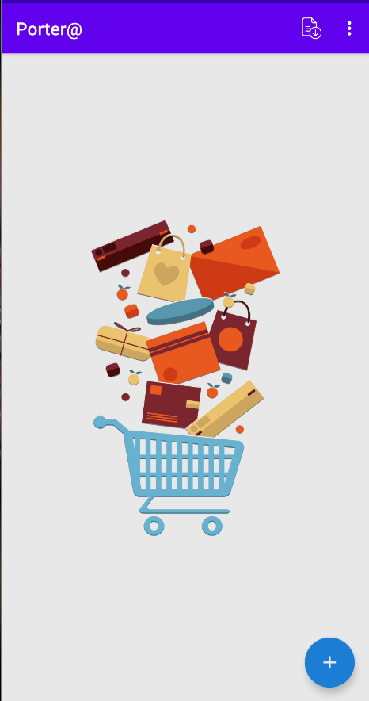
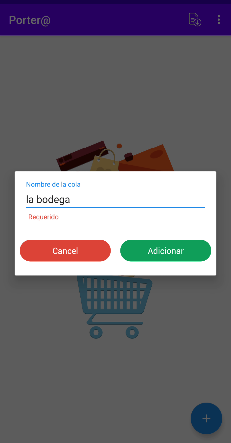
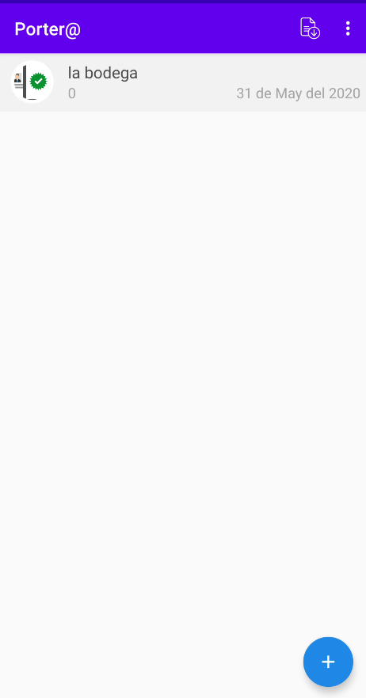

# Porter@
Te molestan las colas que nunca se acaban ?
Te molestan las personas que marcan infinitas veces y no puedes comprar tus productos ?

Con esta aplicación puedes controlar una cola garantizando que una persona pase solo una vez, durante un tiempo determinado, mediante el escaneo de forma fácil y rápida de su carnét de identidad.

[Instalar desde Apklis](https://www.apklis.cu/application/cu.control.queue)

### Funcionamiento:
- El organizador de la cola con la aplicación instalada da inicio a una cola.
- El cliente presenta su carnét de identidad.
- El organizador de la cola escanea el mismo y se almacena en una base de datos local del teléfono.
- Si la persona se presenta nuevamente con el mismo carnet de identidad, saltará una alerta de acceso preexistente.
- El organizador de la cola puede exportar el registro de colas realizadas en el día .
- En tiempos de COVID esta aplicación sirve para en análisis de contacto  de una persona confirmada.

### Pantallas

|  |  |
|:---------------------------------------|:---------------------------------------|
|  |  |

